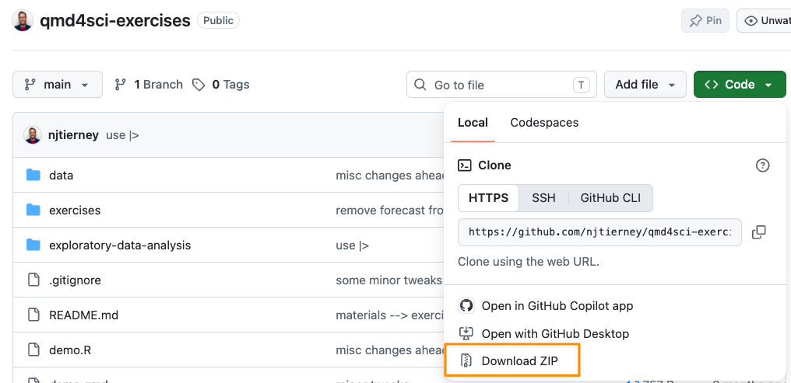

# Installation

In this section, the aim is to have everyone set up with R, RStudio, Quarto, and LaTeX (using TinyTeX), which Quarto needs to make PDFs.

## Overview

* **Duration** 15 minutes

## Questions

* How do I install R?
* How do I install Quarto?
* How do I install LaTeX in a sane way?
* How do I download the exercises?

## Software Setup

### R

We recommend R 4.5.0 or later. You can check which version you have with:

```{r}
#| label: r-version
#| eval: false
R.version.string
```

You can download R here:

::: {.panel-tabset}

#### Windows

[https://cloud.r-project.org/bin/windows/](https://cloud.r-project.org/bin/windows/)

#### MacOS

[https://cloud.r-project.org/bin/macosx/](https://cloud.r-project.org/bin/macosx/)

#### Linux

[https://cloud.r-project.org/bin/linux/](https://cloud.r-project.org/bin/linux/)

:::

### RStudio

[https://docs.posit.co/ide/user/#rstudio-ide-oss-downloads](https://docs.posit.co/ide/user/#rstudio-ide-oss-downloads)

### Quarto

[Quarto installation page](https://quarto.org/docs/get-started/)

## Checking you are up to date

To ensure you are up to date, run the following script to install the packages.

```{r}
#| label: install-rmd
#| eval: false
install.packages(c(
  "broom",
  "fs",
  "here",
  "knitr",
  "naniar",
  "quarto",
  "rmarkdown",
  "skimr",
  "spelling",
  "tidyverse",
  "tinytex",
  "usethis",
  "visdat"
))
```

## A note on PDF

Quarto documents can be compiled to PDF, which is a great feature. In order to convert the documents to PDF, they use a software called [LaTeX](https://www.latex-project.org/) (pronounced la-tek or lay-tek).

**You need to install LaTeX yourself.** Quarto doesn't come with it. I recommend that you use [TinyTeX](https://yihui.org/tinytex/), the steps are below. 

Once TinyTeX is installed, Quarto takes care of the rest. Its [built-in LaTeX engine](https://quarto.org/docs/output-formats/pdf-engine.html#latexmk) runs LaTeX for you, and installs any missing LaTeX packages as it goes.

### Installing TinyTeX

Installing LaTeX [can be a pain](https://yihui.name/tinytex/pain/), but thankfully Yihui Xie has put a lot of time and energy into making an easier way to install it - [`tinytex`](https://yihui.name/tinytex/). `tinytex` is an R package that installs a sane, lightweight (<200Mb) version of LaTeX.

To install TinyTeX, run the following in R. It takes a few minutes:

```{r}
#| label: run-tiny-tex
#| eval: false
tinytex::install_tinytex()
```

If you get the following error, **this is good**! As it means that TeX has already been installed:

```
Error: Detected an existing tlmgr at /usr/local/bin/tlmgr. It seems TeX Live has been installed (check tinytex::tinytex_root()). You have to uninstall it, or use install_tinytex(force = TRUE) if you are sure TinyTeX can override it (e.g., you are a PATH expert or installed TinyTeX previously).
```

Alternatively, you can run the following from the terminal

```{shell}
#| eval: false
quarto install tinytex
# follow the prompts from here
```

### Problem solving with LaTeX

If you have any problems with installing `tinytex`, I recommend you check out the [tinytex FAQ page](https://yihui.name/tinytex/faq/).

## Test Script

You should be able to run the following code on your machine

```{r}
#| label: library-test
#| eval: false
library(broom)
library(fs)
library(here)
library(knitr)
library(naniar)
library(quarto)
library(rmarkdown)
library(skimr)
library(spelling)
library(tidyverse)
library(tinytex)
library(usethis)
library(visdat)
```

## Downloading the exercises {#sec-download-exercises}

The exercises and data for the course live in their own repository, [qmd4sci-exercises](https://github.com/njtierney/qmd4sci-exercises). This code from usethis will automagically download them, and open up an RStudio project. We will talk more about those later.

```{r}
#| label: download-exercises
#| eval: false
usethis::use_course("njtierney/qmd4sci-exercises")
```

If this doesn't work on your machine, the same files are in this zip - clicking this link should download it for you: <https://github.com/njtierney/qmd4sci-exercises/archive/refs/heads/main.zip>

Alternatively you can go to <https://github.com/njtierney/qmd4sci-exercises> and download them there by navigating to the "Download Zip" link - see below for a screenshot:


